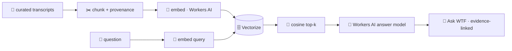

<!-- readme-gen:start:hero -->
<div align="center">


# wtfmedia

**The WTF catalogue, made askable with evidence-linked answers.**

</div>
<!-- readme-gen:end:hero -->

<!-- readme-gen:start:badges -->
<div align="center">


<p align="center">
  
</p>

</div>
<!-- readme-gen:end:badges -->

> Every WTF podcast conversation, turned into an operating system. **wtfmedia** indexes the catalogue, then lets the team ask grounded questions with source-backed answers. Exact-moment links are shown only where transcript timestamps are available.

---

## Current Release

The current production release is the WTF OS web app on `https://wtfhq.in` with
Ask WTF backed by Cloudflare R2, KV, Vectorize, D1, Queues, and Workers AI.
Ask WTF supports three source modes:

- `published`: published YouTube transcript evidence.
- `uncut`: approved uncut transcript evidence.
- `both`: combined retrieval over both approved corpora.

Release receipt as of 2026-08-31:

- 55 published transcript assets are reconciled across R2/KV/Vectorize/D1.
- 8 approved uncut text assets are reconciled across R2/KV/Vectorize/D1.
- D1 `wtfmedia-ops` records 63 available source assets, 63 active transcript
  versions, 6,354 active chunks, and 63 completed ingestion jobs.
- Live `/api/chat` returns HTTP 200 across `published`, `uncut`, and `both`.

Deferred from the clean ingestion claim: `WTF is a Battery?`,
`WEF - Economics`, `The Foundery`, and the `Brain Armstrong` transcript-row
mismatch. Do not describe those rows as fully ingested until the sheet and
source-asset mismatches are resolved.

---

<!-- readme-gen:start:features -->
<table>
<tr>
<td width="50%" valign="top">

### 🕸️ Connections
An experimental view of recurring themes and ideas across the catalogue. It is not a verified people, ownership, or company index; claims in those categories need curated source metadata.

</td>
<td width="50%" valign="top">

### 💬 Ask WTF
The live path is bounded RAG with source citations over `published`, `uncut`, and `both` modes. It retrieves evidence, validates citation metadata, and falls back truthfully when synthesis citations are weak.

</td>
</tr>
<tr>
<td width="50%" valign="top">

### 🧠 Cloudflare-native retrieval
Workers AI handles Cloudflare-side embedding and answer inference. R2 stores source text, KV records ingest state, Vectorize serves retrieval, D1 records provenance, and Queues handle ingestion.

</td>
<td width="50%" valign="top">

### 🎬 Production library
55 published episodes across the current catalogue, with 43 timestamp sidecars and 12 fallback transcript-only sources. Timestamp links are conditional on per-source timing data.

</td>
</tr>
</table>
<!-- readme-gen:end:features -->

---

## Quick Start

```bash
git clone https://github.com/Sheshiyer/wtfmedia.git
cd wtfmedia

# 1) Extract + transcribe a channel (Python)
pip install -r scripts/requirements.txt          # needs yt-dlp on PATH
python3 scripts/yt_channel_extract.py "https://www.youtube.com/@nikhil.kamath/podcasts"
python3 scripts/yt_transcripts_fetch.py data/nikhil-kamath/episodes.json --no-ytdlp-fallback

# 2) Build the timestamped vector index (needs NVIDIA_API_KEY in ~/.claude/.env)
python3 scripts/build_timestamped.py

# 3) Run the web app
cd web && npm install
NVIDIA_API_KEY=nvapi-xxxx npm run dev            # http://localhost:3000
```

> **Environment:** legacy local rebuild scripts still use `NVIDIA_API_KEY`.
> Production Ask WTF uses Cloudflare bindings/secrets. Never commit `.env`
> values, Cloudflare API tokens, Worker secrets, transcript payloads, or local
> machine paths.

## Agent Pickup

Start with [docs/AGENT-ONBOARDING.md](docs/AGENT-ONBOARDING.md), then read
`PROJECT.md`, `AGENTS.md`, and `.project/HANDOFF.md`. Those files explain the
current release receipts, Cloudflare resource names, source-mode chat contract,
deferred corpus rows, and gated actions.

---

<!-- readme-gen:start:architecture -->
## How it works

<div align="center">

</div>



The public web app now runs through Cloudflare. Workers AI, R2, Queue, KV,
Vectorize, and D1 provide retrieval, inference, ingestion, and provenance while
the browser keeps the same citation response contract. The legacy local index
remains a rebuild reference; see [the infrastructure design](docs/CLOUDFLARE-INFRASTRUCTURE.md), [migration plan](docs/CLOUDFLARE-MIGRATION-PLAN.md), and [agent onboarding](docs/AGENT-ONBOARDING.md).

The corpus provenance receipt records 63 approved source assets: 55 published
transcripts and 8 approved uncut text assets. Of the published episodes, 43
have verified caption timing and can produce a `youtube?t=` citation; the other
12 deliberately link only to the source video. See the [production evaluation](docs/PRODUCTION-EVALUATION.md).
<!-- readme-gen:end:architecture -->

---

<!-- readme-gen:start:tree -->
## Project structure

```
📦 wtfmedia
├── 📂 scripts/                    # Python pipeline
│   ├── 📄 yt_channel_extract.py   # channel/playlist → episodes.json + urls.txt
│   ├── 📄 yt_transcripts_fetch.py # transcripts via youtube_transcript_api (+yt-dlp fallback)
│   ├── 📄 build_timestamped.py    # chunk + embed (NVIDIA NIM) → timestamped vectors.json
│   ├── 📄 build_connections.py    # cross-podcast curation graph (nodes/edges/overlaps)
│   └── 📄 build_embeddings.py     # (legacy, non-timestamped build)
├── 📂 agent/                      # Legacy local Crew experiment (not deployed)
│   ├── 📄 retriever.py            # local cosine retrieval experiment
│   └── 📄 server.py               # local-only experiment server
├── 📂 web/                        # Next.js 15 app (App Router)
│   ├── 📂 app/
│   │   ├── 📂 api/chat/           # RAG endpoint: embed → retrieve → stream
│   │   ├── 📂 chat/               # "Ask WTF" UI (markdown + clickable citations)
│   │   ├── 📂 episodes/           # production library + transcript drawer
│   │   └── 📄 page.tsx            # control room (home)
│   ├── 📂 components/             # product UI, wordmark, and episode components
│   ├── 📂 lib/                    # nvidia, vectors, episodes, modules, guests
│   └── 📂 src/data/              # episodes.json + vectors.json (committed)
├── 📂 cloudflare/                 # Edge RAG Worker + Cloudflare bindings
├── 📂 docs/                       # Infrastructure, onboarding, release/eval notes
├── 📂 .project/                   # Agent handoff and project packet
├── 📂 .planning/                  # GSD planning state and phase evidence
└── 📄 README.md
```
<!-- readme-gen:end:tree -->

---

<!-- readme-gen:start:health -->
## Project health

| Category | Status | Score |
|:---------|:------:|------:|
| Feature (Ask WTF) | ████████████████████ | live |
| Type Safety (strict TS) | ████████████████████ | 100% |
| Pipeline reproducible | ████████████████████ | 100% |
| Tests/evals | ████████████████░░░░ | focused release checks |
| Edge migration | ████████████████████ | production path live |
| Docs | ██████████████████░░ | release refresh |

> **Stage: live release with gated expansion.** The approved queryable corpus is
> reconciled across the Cloudflare retrieval/provenance path. Full sheet closure
> still excludes the four deferred transcript/source mismatches listed above.
<!-- readme-gen:end:health -->

---

## License

Internal / proprietary — © 2026 wtfmedia. Brand cues referenced from [allthingswtf.com](https://allthingswtf.com/). Podcast content © their respective owners (Nikhil Kamath / WTF).

<!-- readme-gen:start:footer -->
<div align="center">


**Stop scrubbing. Start asking.**

Built by [spaceblanket.ai](https://spaceblanket.ai)

</div>
<!-- readme-gen:end:footer -->
