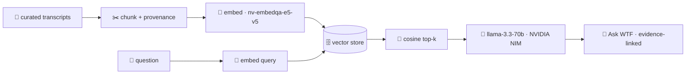

<!-- readme-gen:start:hero -->
<div align="center">


# wtfmedia

**The WTF catalogue, made askable with evidence-linked answers.**

</div>
<!-- readme-gen:end:hero -->

<!-- readme-gen:start:badges -->
<div align="center">


<p align="center">
  
</p>

</div>
<!-- readme-gen:end:badges -->

> Every WTF podcast conversation, turned into an operating system. **wtfmedia** indexes the catalogue, then lets the team ask grounded questions with source-backed answers. Exact-moment links are shown only where transcript timestamps are available.

---

<!-- readme-gen:start:features -->
<table>
<tr>
<td width="50%" valign="top">

### 🕸️ Connections
An experimental view of recurring themes and ideas across the catalogue. It is not a verified people, ownership, or company index; claims in those categories need curated source metadata.

</td>
<td width="50%" valign="top">

### 💬 Ask WTF
The live Fast path is bounded RAG with source citations. It abstains from unsupported role, ownership, and corpus-wide recurrence claims instead of inferring them from a handful of excerpts.

</td>
</tr>
<tr>
<td width="50%" valign="top">

### 🧠 NVIDIA NIM throughout
`nv-embedqa-e5-v5` retrieval, a ranked picker of chat models (`llama-3.3-70b` default), the connections labeller, and the crew, all on NIM. Key stays server-side.

</td>
<td width="50%" valign="top">

### 🎬 Production library
55 episodes across the current catalogue — real thumbnails and transcript sources. Timestamp links are conditional on per-source timing data.

</td>
</tr>
</table>
<!-- readme-gen:end:features -->

---

## Quick Start

```bash
git clone https://github.com/Sheshiyer/wtfmedia.git
cd wtfmedia

# 1) Extract + transcribe a channel (Python)
pip install -r scripts/requirements.txt          # needs yt-dlp on PATH
python3 scripts/yt_channel_extract.py "https://www.youtube.com/@nikhil.kamath/podcasts"
python3 scripts/yt_transcripts_fetch.py data/nikhil-kamath/episodes.json --no-ytdlp-fallback

# 2) Build the timestamped vector index (needs NVIDIA_API_KEY in ~/.claude/.env)
python3 scripts/build_timestamped.py

# 3) Run the web app
cd web && npm install
NVIDIA_API_KEY=nvapi-xxxx npm run dev            # http://localhost:3000
```

> **Environment:** the app needs `NVIDIA_API_KEY` at runtime (server-side only). On Vercel, set it as a project env var. Get a key at [build.nvidia.com](https://build.nvidia.com).

---

<!-- readme-gen:start:architecture -->
## How it works

<div align="center">

</div>



The Vercel UI now calls the Cloudflare edge RAG provider server-to-server. Workers AI, R2, Queue, KV, and Vectorize provide retrieval and inference while the browser keeps the same citation response contract. The legacy local index remains a rebuild reference; see [the infrastructure design](docs/CLOUDFLARE-INFRASTRUCTURE.md) and [migration plan](docs/CLOUDFLARE-MIGRATION-PLAN.md).

The corpus provenance manifest records 55 source records and their hashes. Of these, 43 have verified caption timing and can produce a `youtube?t=` citation; the other 12 deliberately link only to the source video. See the [production evaluation](docs/PRODUCTION-EVALUATION.md).
<!-- readme-gen:end:architecture -->

---

<!-- readme-gen:start:tree -->
## Project structure

```
📦 wtfmedia
├── 📂 scripts/                    # Python pipeline
│   ├── 📄 yt_channel_extract.py   # channel/playlist → episodes.json + urls.txt
│   ├── 📄 yt_transcripts_fetch.py # transcripts via youtube_transcript_api (+yt-dlp fallback)
│   ├── 📄 build_timestamped.py    # chunk + embed (NVIDIA NIM) → timestamped vectors.json
│   ├── 📄 build_connections.py    # cross-podcast curation graph (nodes/edges/overlaps)
│   └── 📄 build_embeddings.py     # (legacy, non-timestamped build)
├── 📂 agent/                      # Legacy local Crew experiment (not deployed)
│   ├── 📄 retriever.py            # local cosine retrieval experiment
│   └── 📄 server.py               # local-only experiment server
├── 📂 web/                        # Next.js 15 app (App Router)
│   ├── 📂 app/
│   │   ├── 📂 api/chat/           # RAG endpoint: embed → retrieve → stream
│   │   ├── 📂 chat/               # "Ask WTF" UI (markdown + clickable citations)
│   │   ├── 📂 episodes/           # production library + transcript drawer
│   │   └── 📄 page.tsx            # control room (home)
│   ├── 📂 components/             # product UI, wordmark, and episode components
│   ├── 📂 lib/                    # nvidia, vectors, episodes, modules, guests
│   └── 📂 src/data/              # episodes.json + vectors.json (committed)
├── 📂 cloudflare/                 # Shadow edge RAG Worker + Cloudflare bindings
├── 📂 docs/                       # Infrastructure and staged migration plan
└── 📄 README.md
```
<!-- readme-gen:end:tree -->

---

<!-- readme-gen:start:health -->
## Project health

| Category | Status | Score |
|:---------|:------:|------:|
| Feature (Ask WTF) | ████████████████████ | 100% |
| Type Safety (strict TS) | ████████████████████ | 100% |
| Pipeline reproducible | ████████████████████ | 100% |
| Tests/evals | ░░░░░░░░░░░░░░░░░░ | 0% |
| Edge migration | ████████░░░░░░░░░░░░ | Shadow pilot |
| Docs | ██████████████████░░ | 90% |

> **Stage: proof of concept.** The Vercel UI and Cloudflare-backed RAG route are live. Full-corpus ingestion continues idempotently; provenance, evaluation, and additional edge protections remain the next hardening release.
<!-- readme-gen:end:health -->

---

## License

Internal / proprietary — © 2026 wtfmedia. Brand cues referenced from [allthingswtf.com](https://allthingswtf.com/). Podcast content © their respective owners (Nikhil Kamath / WTF).

<!-- readme-gen:start:footer -->
<div align="center">


**Stop scrubbing. Start asking.**

Built by [spaceblanket.ai](https://spaceblanket.ai)

</div>
<!-- readme-gen:end:footer -->
