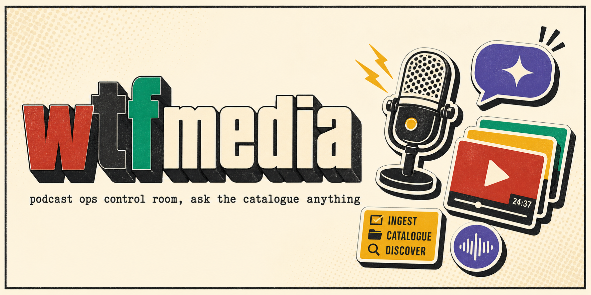
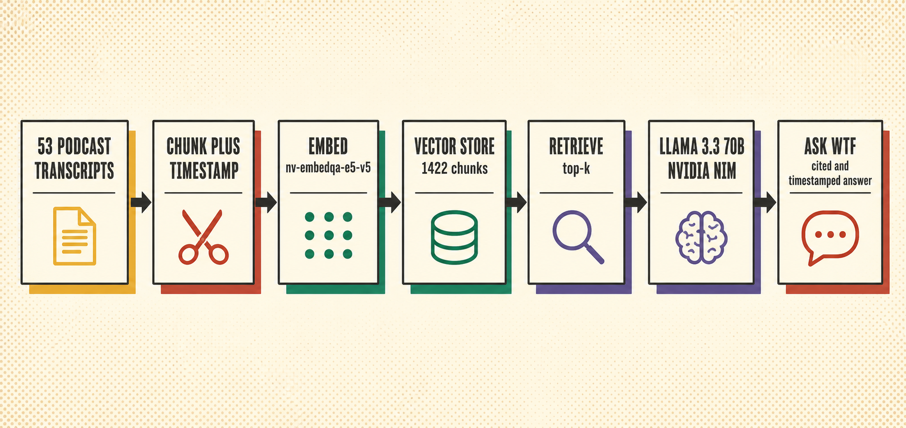
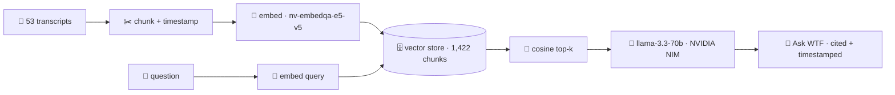

<!-- readme-gen:start:hero -->
<div align="center">



# wtfmedia

**The WTF catalogue, made askable. Every conversation, cited to the second.**

</div>
<!-- readme-gen:end:hero -->

<!-- readme-gen:start:badges -->
<div align="center">


<p align="center">
  
</p>

</div>
<!-- readme-gen:end:badges -->

> Every WTF podcast conversation, turned into an operating system. **wtfmedia** indexes the entire catalogue, then lets the team **ask it anything** — with answers cited and **deep-linked to the exact second** in the source episode. Research that took an afternoon now takes a sentence.

---

<!-- readme-gen:start:features -->
<table>
<tr>
<td width="50%" valign="top">

### 💬 Ask WTF
RAG over 53 episodes. Streamed answers grounded in real transcripts, with citations that jump to `youtube?t=` the exact moment.

</td>
<td width="50%" valign="top">

### 🧠 Two NVIDIA NIM models
`nv-embedqa-e5-v5` for retrieval inference, `llama-3.3-70b-instruct` for generation. Key stays server-side.

</td>
</tr>
<tr>
<td width="50%" valign="top">

### 🎬 Production library
53 episodes across 4 shows — drag carousels, real thumbnails, and a click-to-jump timestamped transcript drawer.

</td>
<td width="50%" valign="top">

### 🎛️ One control room
14 operating modules (research → contracts → payments → publishing) under a single brand-true, playground UI.

</td>
</tr>
</table>
<!-- readme-gen:end:features -->

---

## Quick Start

```bash
git clone https://github.com/Sheshiyer/wtfmedia.git
cd wtfmedia

# 1) Extract + transcribe a channel (Python)
pip install -r scripts/requirements.txt          # needs yt-dlp on PATH
python3 scripts/yt_channel_extract.py "https://www.youtube.com/@nikhil.kamath/podcasts"
python3 scripts/yt_transcripts_fetch.py data/nikhil-kamath/episodes.json --no-ytdlp-fallback

# 2) Build the timestamped vector index (needs NVIDIA_API_KEY in ~/.claude/.env)
python3 scripts/build_timestamped.py

# 3) Run the web app
cd web && npm install
NVIDIA_API_KEY=nvapi-xxxx npm run dev            # http://localhost:3000
```

> **Environment:** the app needs `NVIDIA_API_KEY` at runtime (server-side only). On Vercel, set it as a project env var. Get a key at [build.nvidia.com](https://build.nvidia.com).

---

<!-- readme-gen:start:architecture -->
## How it works

<div align="center">

</div>



The embeddings are packed as base64 Float32 in `web/src/data/vectors.json` and loaded server-side; cosine top-k retrieval feeds the chat model. Citations carry each chunk's `start` second, so every `[n]` deep-links to that moment.
<!-- readme-gen:end:architecture -->

---

<!-- readme-gen:start:tree -->
## Project structure

```
📦 wtfmedia
├── 📂 scripts/                    # Python pipeline
│   ├── 📄 yt_channel_extract.py   # channel/playlist → episodes.json + urls.txt
│   ├── 📄 yt_transcripts_fetch.py # transcripts via youtube_transcript_api (+yt-dlp fallback)
│   ├── 📄 build_timestamped.py    # chunk + embed (NVIDIA NIM) → timestamped vectors.json
│   └── 📄 build_embeddings.py     # (legacy, non-timestamped build)
├── 📂 web/                        # Next.js 15 app (App Router)
│   ├── 📂 app/
│   │   ├── 📂 api/chat/           # RAG endpoint: embed → retrieve → stream
│   │   ├── 📂 chat/               # "Ask WTF" UI (markdown + clickable citations)
│   │   ├── 📂 episodes/           # production library + transcript drawer
│   │   └── 📄 page.tsx            # control room (home)
│   ├── 📂 components/             # cursor, presence, paint canvas, wordmark, drag rows…
│   ├── 📂 lib/                    # nvidia, vectors, episodes, modules, guests
│   └── 📂 src/data/              # episodes.json + vectors.json (committed)
└── 📄 README.md
```
<!-- readme-gen:end:tree -->

---

<!-- readme-gen:start:health -->
## Project health

| Category | Status | Score |
|:---------|:------:|------:|
| Feature (Ask WTF) | ████████████████████ | 100% |
| Type Safety (strict TS) | ████████████████████ | 100% |
| Pipeline reproducible | ████████████████████ | 100% |
| Tests | ░░░░░░░░░░░░░░░░░░░░ | 0% |
| Docs | ████████████████░░░░ | 80% |

> **Stage: proof of concept.** Ask WTF + library are live; the other 12 modules are roadmap (tracked in an internal product brief).
<!-- readme-gen:end:health -->

---

## License

Internal / proprietary — © 2026 wtfmedia. Brand cues referenced from [allthingswtf.com](https://allthingswtf.com/). Podcast content © their respective owners (Nikhil Kamath / WTF).

<!-- readme-gen:start:footer -->
<div align="center">


**Stop scrubbing. Start asking.**

Built by [spaceblanket.ai](https://spaceblanket.ai)

</div>
<!-- readme-gen:end:footer -->
