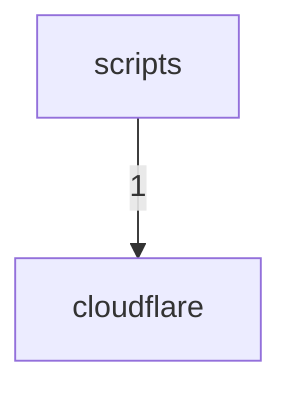

# Dependency Graph

> Generated by `scripts/generate-architecture-ledger.mjs`.
> Source fingerprint: `879b5213ab735b804f3d9f21ffc091b679b652086b76a44eee6724c8da789e4d`.

## Edge counts

| From | To | Imports |
|---|---|---|
| `scripts` | `cloudflare` | 1 |