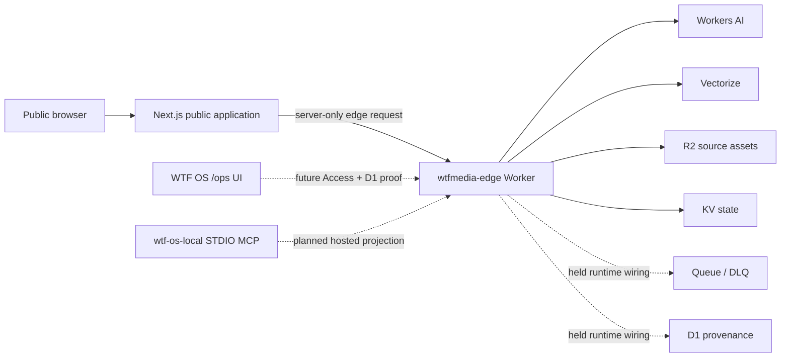

# WTF Media high-level dependency graph

> Generated by `scripts/generate-architecture-ledger.mjs`.
> Source fingerprint: `2c87c9609efa5f1e3af0953706f920c42fb6f19fa23fb07cb45b9d4036715548`.

## Interpretation

- Solid edges are repository source relationships or declared bindings.
- Dashed edges are held or owner-gated integrations, not runtime proof.
- The public Phase 1 route contract is independent of Cloudflare Access provisioning.
- See [architecture.html](architecture.html) for evidence, statuses, and update gates.
