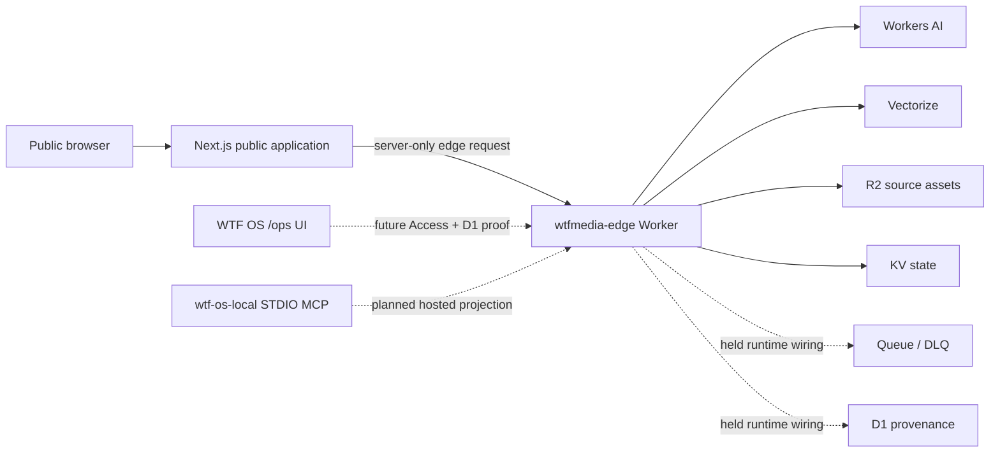

# WTF Media high-level dependency graph

> Generated by `scripts/generate-architecture-ledger.mjs`.
> Source fingerprint: `47e9c8f8a484347e34ef6bd15449c4a36e3ab7eb66caa91133acefde29d3a6f9`.

## Interpretation

- Solid edges are repository source relationships or declared bindings.
- Dashed edges are held or owner-gated integrations, not runtime proof.
- The public Phase 1 route contract is independent of Cloudflare Access provisioning.
- See [architecture.html](architecture.html) for evidence, statuses, and update gates.
