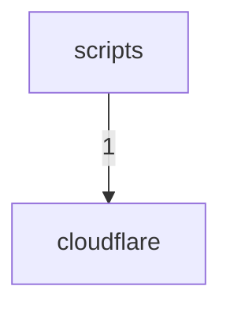

# Dependency Graph

> Generated by `scripts/generate-architecture-ledger.mjs`.
> Source fingerprint: `fb68da95649c48c3072a5906e6933a1071c3f5f6eb6ce9ce7941f8bcf5330fc0`.

## Edge counts

| From | To | Imports |
|---|---|---|
| `scripts` | `cloudflare` | 1 |
