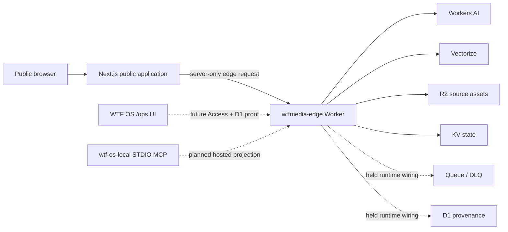

# WTF Media high-level dependency graph

> Generated by `scripts/generate-architecture-ledger.mjs`.
> Source fingerprint: `b6c004a4669067f27eb7fb572dffd99f709f78f60b13652132daa280c5bd920c`.

```mermaid
flowchart LR
  Browser[Public browser] --> Web[Next.js public application]
  Web -->|server-only edge request| Worker[wtfmedia-edge Worker]
  Worker --> AI[Workers AI]
  Worker --> Vec[Vectorize]
  Worker --> R2[R2 source assets]
  Worker --> KV[KV state]
  Worker -. held runtime wiring .-> Queue[Queue / DLQ]
  Worker -. held runtime wiring .-> D1[D1 provenance]
  Ops[WTF OS /ops UI] -. future Access + D1 proof .-> Worker
  MCP[wtf-os-local STDIO MCP] -. planned hosted projection .-> Worker
```

## Interpretation

- Solid edges are repository source relationships or declared bindings.
- Dashed edges are held or owner-gated integrations, not runtime proof.
- The public Phase 1 route contract is independent of Cloudflare Access provisioning.
- See [architecture.html](architecture.html) for evidence, statuses, and update gates.
