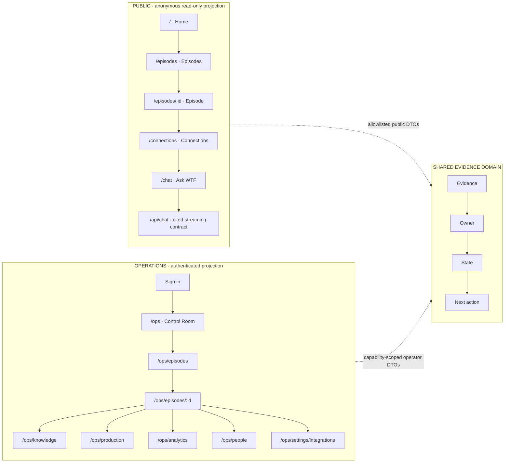
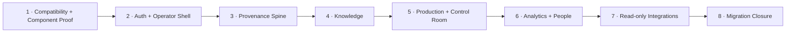

# WTF Media — One Brain Application Flow

**Milestone:** v1.0 One Brain Re-foundation

**Execution authorization:** Phases 1 and 2 only

**Visual companion:** [Application flow board](./visuals/wtf-one-brain-app-flow-v1.png)

**Moodboard:** [Visual system moodboard](./visuals/wtf-one-brain-moodboard-v1.png)

The generated boards communicate mood and hierarchy. This document is the
deterministic source of truth for routes, permissions, component boundaries,
and phase order.

## Product Loop

```text
EVIDENCE -> OWNER -> STATE -> NEXT ACTION
```

Every operational summary, answer, metric, relationship, and integration state
must resolve to evidence, an accountable owner, a reporting or workflow state,
or an explicit unknown. Missing data never silently becomes zero.

## Projection Flow



Public and operator projections may share domain queries and canonical IDs.
They must not share authorization policy, cache namespace, search projection,
serialized DTO, or interaction state.

## Canonical Episode Workspace

The episode is the primary join point for the operating system.

| Tab | Responsibility | First active phase |
|---|---|---:|
| Overview | Identity, owner, stage, dates, blockers, and dominant action | 3 |
| Assets | Source assets, versions, hashes, authority, and availability | 3 |
| Transcript | Versioned passages, speakers, search, and citations | 3 |
| Timelines | Separate clean-cut and published-video coordinates | 3 |
| Clips | Evidence-linked candidates and downstream references | 5 |
| Production | Stage, owner, shoot/publish dates, briefs, and blockers | 5 |
| Analytics | Source, reporting window, freshness, and lineage | 6 |
| Activity | Attributable changes, reconciliation, and failures | 3 |

Phases 1 and 2 may show synthetic or truthful empty workspace states for shell
and component proof. They do not fabricate canonical episode records.

## Phase Sequence



### Execute first

- **Phase 1:** freeze public contracts; create semantic tokens, state
  vocabulary, fixtures, stories, tests, and the first migrated real component.
- **Phase 2:** approve the permission model; add identity/session, server-side
  authorization, separate DTO/cache/search boundaries, the `/ops` shell, and a
  truthful empty Control Room.

### Planned later; not execution-authorized

- **Phase 3:** canonical episode provenance and dual timelines.
- **Phase 4:** scoped Knowledge and saved evidence.
- **Phase 5:** production workflow and actionable Control Room.
- **Phase 6:** Analytics and People projections.
- **Phase 7:** one read-only integration adapter at a time.
- **Phase 8:** final consumer migration and legacy removal.

## Phase 1–2 User Journey

1. An anonymous visitor uses every existing public route with unchanged
   bookmarks, queries, streaming behavior, citations, and safe errors.
2. An approved operator signs in through the selected organization identity
   provider.
3. The server resolves the operator's capabilities before protected data loads.
4. The operator enters `/ops` and sees current workspace context, permission
   scope, system state, and a truthful empty/unavailable Control Room.
5. Public and operator navigation, cache, search, errors, and serialized data
   remain separated even when both projections use the same evidence domain.
6. Keyboard, focus, reduced-motion, viewport, accessibility, privacy, visual,
   and compatibility tests block regressions.

## Non-Negotiable Flow States

The interface must distinguish:

`unknown` · `unavailable` · `stale` · `partial` · `empty` · `permission-denied`
· `error` · `offline` · `unmapped` · `conflicted` · `measured-zero`

Each state defines what happened, what remains usable, whether retry is safe,
and who owns resolution when an owner is known.
